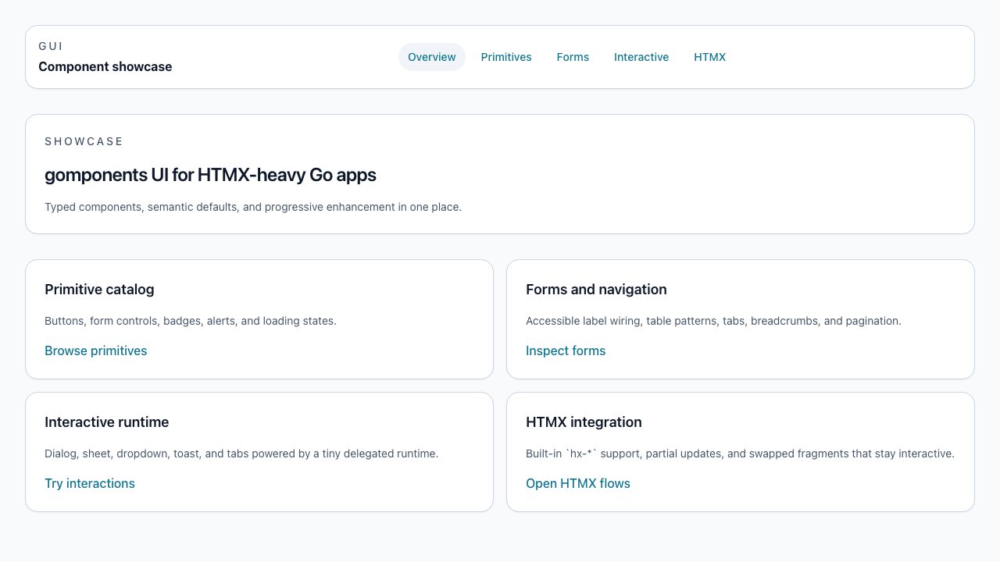
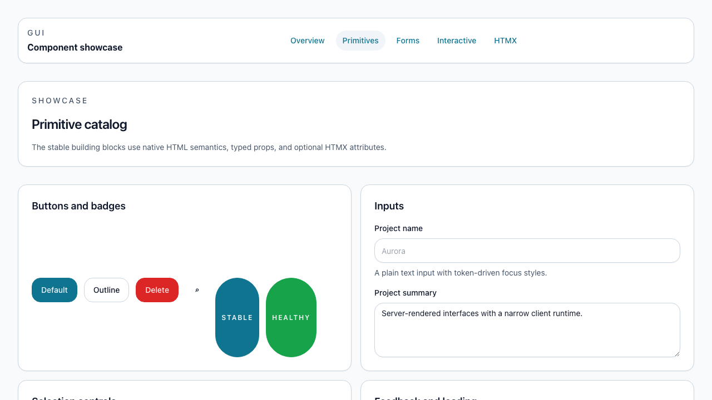
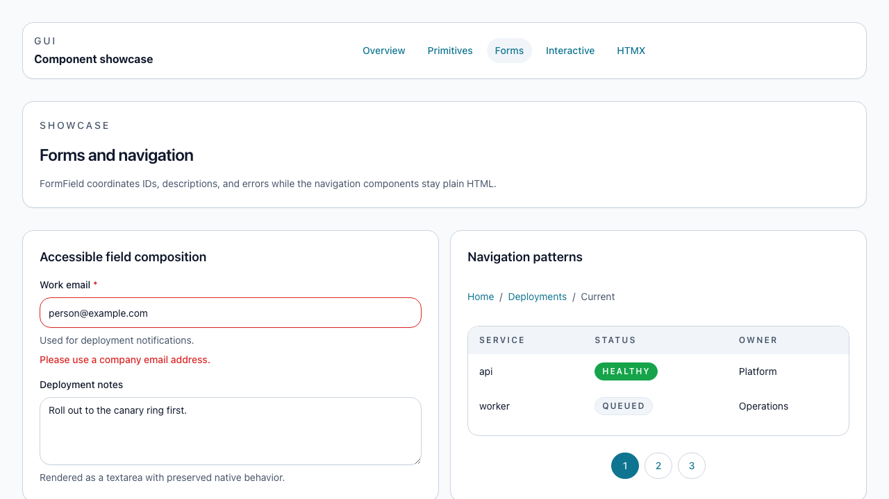
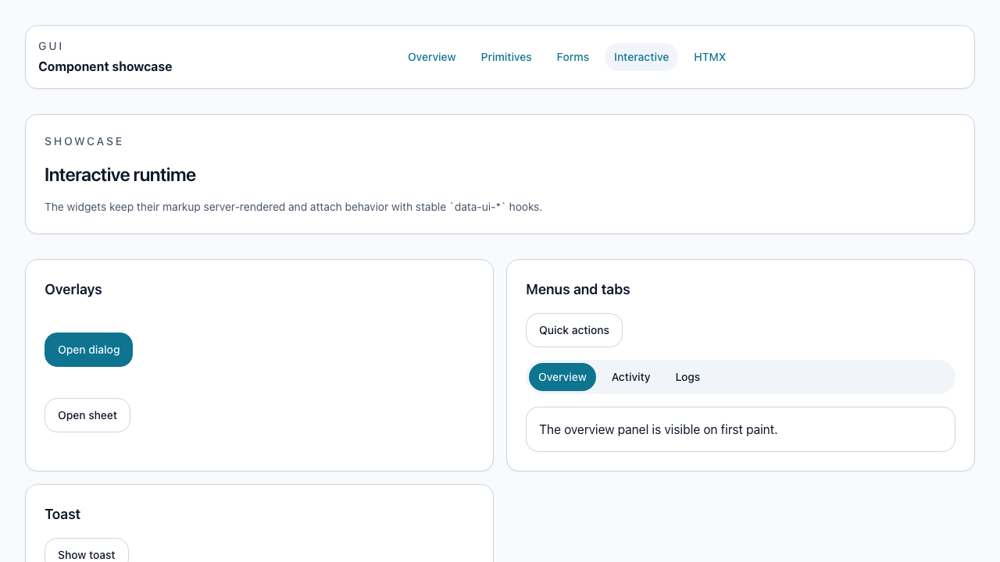

# goth

`github.com/pmenglund/goth` is a gomponents-native component library for server-rendered Go applications. It provides typed, HTMX-friendly UI components, a Tailwind-backed token system, and a small runtime for the interactive widgets that need keyboard and focus behavior.

## Using the module

Install the module with:

```sh
go get github.com/pmenglund/goth@latest
```

The module does not expose one large root API. Import the component packages you need directly from `components/...`, and import `github.com/pmenglund/goth/htmx` when you want to attach `hx-*` attributes through typed props.

```go
package ui

import (
	g "maragu.dev/gomponents"
	h "maragu.dev/gomponents/html"

	"github.com/pmenglund/goth/components/button"
	"github.com/pmenglund/goth/components/card"
)

func SettingsCard() g.Node {
	return card.Card(card.Props{},
		h.H2(h.Class("text-lg font-semibold"), g.Text("Profile")),
		h.P(g.Text("Update the account details shown to other users.")),
		button.Button(button.Props{Variant: button.VariantDefault}, g.Text("Save changes")),
	)
}
```

To get the intended styling and behavior in your own app:

- Serve `theme/preset.css` on pages that render `goth` components.
- Build a Tailwind bundle from `assets/ui.css`. The simplest integration today is to copy that file into your app and compile it with a `content` list that includes both your app's Go files and the `goth` component source files you use.
- Serve `assets/ui.js` if you use interactive components such as `dialog`, `dropdownmenu`, `sheet`, `tabs`, or `toast`.
- Include HTMX itself only if your app uses the `htmx.Props` helpers.

The runnable showcase in `examples/showcase` is the reference integration. It shows the stylesheet and script wiring, component composition patterns, and HTMX partial-update flows end to end.

## Host app styling

Use `Class` when you want to add Tailwind utilities to a component root while keeping the goth defaults. Use `classmode.ClassReplace` when your app owns the exact root styling and should not render the default goth root classes. Components that generate child markup also expose slot class props for common internal elements.

```go
package ui

import (
	g "maragu.dev/gomponents"

	"github.com/pmenglund/goth/components/card"
	"github.com/pmenglund/goth/components/classmode"
)

func ReleaseCard() g.Node {
	return card.Card(card.Props{
		ClassMode:  classmode.ClassReplace,
		Class:      "rounded-lg border border-slate-200 bg-white p-4 shadow-sm",
		Title:      "Release queue",
		TitleClass: "text-base font-bold text-slate-950",
	}, g.Text("Three deploys are ready for review."))
}
```

If your app builds Tailwind CSS, include both your app's Go files and the goth component Go files in the Tailwind `content` list so utilities from both sources are retained. Serve `assets/ui.js` only when you use interactive goth widgets such as `dialog`, `dropdownmenu`, `sheet`, `tabs`, or `toast`.

## Showcase

The repository includes a runnable showcase app so you can inspect the component library before wiring it into your own application.

<p>
  
  
</p>
<p>
  
  
</p>

## Development

Run the CSS build and the showcase app from the repository root:

- `npm install`
- `npm run build:css`
- `go run ./examples/showcase`

The showcase serves:

- `/` for the overview
- `/primitives` for the primitive catalog
- `/forms` for form composition
- `/interactive` for dialog, dropdown, toast, and sheet
- `/htmx` for partial-update patterns
- `/examples/form-workflow` for a realistic, testable release request flow
- `/examples/runtime-workbench` for a testable runtime control surface

## Validation

- `go test ./...`
- `npm run build:css`
- `npm run test:e2e`
